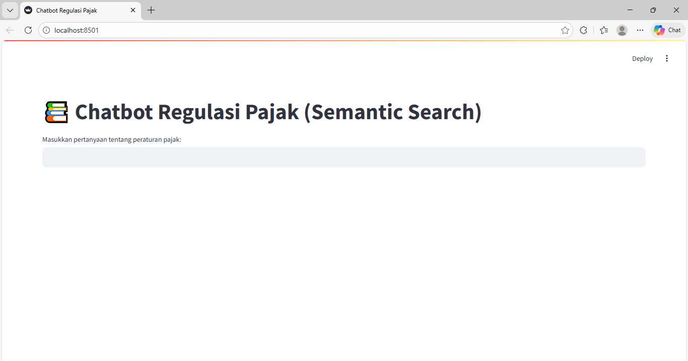
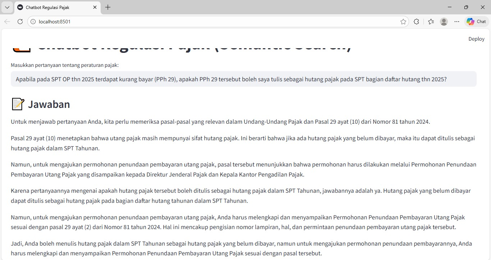

# AI-Powered Tax Regulation Search & Chatbot

Sistem AI untuk pencarian dan tanya jawab peraturan pajak Indonesia menggunakan **Vector Database** dan **Semantic Search**.

---

## Demo
Klik untuk melihat demo:  
(https://drive.google.com/drive/folders/1L2G9zS0v3t52OD1Tm91_Y6E387UDehmd?usp=sharing)

---

## Overview
Project ini mengembangkan **knowledge base peraturan perpajakan Indonesia tahun 2024** berbasis vector database untuk meningkatkan kualitas pencarian informasi hukum pajak.

Permasalahan utama:
- Banyaknya peraturan pajak yang kompleks dan terus berubah  
- Sistem pencarian masih berbasis keyword  
- Sulit menemukan informasi yang relevan secara cepat  

Solusi dalam project ini:  
Menggunakan pendekatan **semantic search berbasis embedding**, sehingga sistem dapat memahami **makna dan konteks pertanyaan**, bukan hanya kata kunci.

---

## AI Chatbot
Sebagai implementasi dari knowledge base, project ini juga menghadirkan **chatbot AI sederhana**.

Chatbot ini mampu:
- Menjawab pertanyaan seputar peraturan pajak  
- Mengambil informasi dari vector database  
- Memberikan hasil berdasarkan konteks (semantic search)  

**Contoh:**

Input: pajak UMKM 2024  
Output: Menampilkan peraturan yang relevan  

---

## Architecture

Data → Preprocessing → Embedding → ChromaDB → Semantic Search → Chatbot  

---

## Features
- Semantic search berbasis embedding  
- Vector database menggunakan ChromaDB  
- AI chatbot sederhana berbasis retrieval  
- Pencarian berbasis konteks (context-aware search)  
- Dataset regulasi pajak Indonesia tahun 2024  

---

## Tech Stack
- Python  
- ChromaDB  
- Sentence Transformers  
- PDFPlumber  
- tqdm  
- Matplotlib  

---

## Requirements
- chromadb
- pdfplumber
- tqdm
- sentence-transformers
- matplotlib

---

## Screenshots

  
  

---

## Insight
- Pencarian berbasis vector database menghasilkan hasil yang lebih relevan dibanding keyword search  
- Sistem mampu memahami konteks pertanyaan pengguna  
- Chatbot dapat menjawab pertanyaan berdasarkan knowledge base yang dibangun  

---
